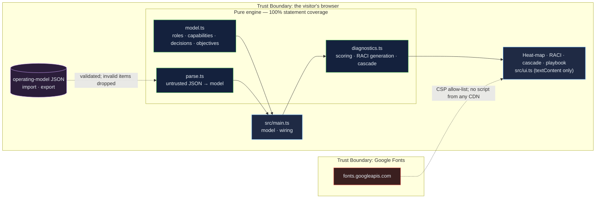

# Enterprise Operating Model Kit: a heat-map, a generated RACI and a verified OKR cascade — diagnostics, not slides

[](https://github.com/Freddricklogan/enterprise-operating-model-kit/actions/workflows/deploy.yml)
[](#5-getting-started--verification)
[](https://github.com/Freddricklogan/enterprise-operating-model-kit/actions/workflows/codeql.yml)
[](LICENSE)
[](https://freddricklogan.github.io/enterprise-operating-model-kit/)

## 1. Executive Summary & Business Impact

**Problem statement.** A new enterprise leader inherits three documents:
a capability map coloured by someone's opinion, a RACI chart drawn from
the org chart rather than from who actually decides, and a stack of OKRs
that were written bottom-up and never checked against the strategy above
them. All three look like an operating model. None of them can be wrong,
because none of them is computed from anything.

**Solution & value delivered.** Three diagnostics as data. A capability
heat-map scores each capability for importance, current maturity and the
target the strategy needs, bands the gap and ranks the first five moves. A
RACI chart is *generated* from decision rights — who decides, recommends,
gives input, is informed — and therefore can be checked: one decider per
decision, at least one recommender. An OKR cascade is built from parent
links and verified: every objective must contribute upward and carry a key
result, and progress is direction-aware. A ninety-day playbook says how the
three are used together. The sample is a regional university; the model
imports and exports as JSON.

**[→ Read the full case study](docs/CASE_STUDY.md)**

| Outcome | How this repo delivers it |
| --- | --- |
| Where the strategy is exposed | `scoreCapabilities()`: priority = importance × gap; a critical band when importance ≥ 4 and the gap is two levels or more |
| A RACI that cannot lie about accountability | `generateRaci()` maps decision rights to letters and lists every decision with no decider, two deciders, or no recommender |
| A cascade that is verified, not assumed | `buildCascade()` finds orphans, unsupported enterprise objectives, unmeasured objectives and cycles; progress is clamped and direction-aware |
| Live, not a slide | Change one maturity score and the bands, priorities and domain summary recompute |
| Your organisation | JSON import through a validating parser that drops invalid items with warnings; export; print |

## 2. Demonstrated Competencies & Technical Skills

- **Systems Architecture & CS** — strict TypeScript; three diagnostics as
  pure functions over one model, tested at their edges (tie ordering, cycle
  detection, clamped progress); Vite build with no inline script so the
  strict CSP holds.
- **Data Science & AI** — n/a. Every figure is arithmetic on assessor scores,
  and the formulas are on the page.
- **Cybersecurity & Compliance** — strict CSP, no CDN scripts,
  untrusted-JSON parser, `textContent`-only rendering; typed ESLint, CodeQL
  and Trivy in CI.
- **EdTech & Human-Centered Design** — built from the Oxford Saïd programme
  on enterprise leadership as a teaching kit: every diagnostic states its
  rule; the RACI letters carry their meaning as accessible names; the tour
  closes a gap and lets the reader watch the map change.

## 3. System Architecture & Data Flow



## 4. Technical Highlights & Engineering Decisions

### ADR-1 — Generate the RACI from decision rights instead of drawing it

**Context.** A RACI drawn by hand records what people are willing to write
down. The failure it exists to catch — nobody accountable — is the one it
cannot see in itself.

**Decision.** The model stores decisions and rights (`decide`, `recommend`,
`input`, `informed`); the chart is derived (`A`, `R`, `C`, `I`) and checked
for exactly one decider and at least one recommender per decision.

**Consequence.** The sample's academic-calendar decision surfaces
immediately: two recommenders, no decider — a real pattern in universities,
where the provost and the registrar each think the other decides.

### ADR-2 — Verify the cascade rather than display it

**Context.** OKR tools show a tree and assume alignment. Objectives written
bottom-up often attach to nothing, or to an objective that itself attaches
to nothing.

**Decision.** `buildCascade()` walks parent links from enterprise
objectives, reports orphans below enterprise level, enterprise objectives
with no contributor, objectives with no key result, and cycles or chains
deeper than four levels. Progress is `(current − baseline) ÷ (target −
baseline)`, clamped, so a lower-is-better key result works.

**Consequence.** The registrar's scheduling objective in the sample is
flagged as contributing to nothing — the honest reading is that it may be
worth doing but is not part of this strategy.

### ADR-3 — Deliver the playbook in-page rather than as a separate docs site

**Context.** The original plan paired the tool with an MkDocs playbook. Two
deployables for one repository means two things to keep in sync.

**Decision.** The ninety-day playbook is a section of the page, printed
with the diagnostics, and the print stylesheet produces the handout.

**Consequence.** One build, one URL, one CSP; the playbook is always
beside the instruments it describes.

## 5. Getting Started & Verification

**Prerequisites.** Node 22 LTS.

```bash
git clone https://github.com/Freddricklogan/enterprise-operating-model-kit.git
cd enterprise-operating-model-kit
npm install
npm run dev        # http://localhost:5173/enterprise-operating-model-kit/
npm run check      # lint → typecheck → validate → test → build
```

**Verification — the numbers this repository actually produced:**

```bash
npm test         # Test Files 2 passed (2) · Tests 12 passed (12)
npm run coverage # All files 100% statements · 84.17% branches
npm run lint     # eslint (typed) — clean
npm run typecheck# tsc --noEmit — clean
npm run validate # html-validate index.html — clean
npm run build    # dist: no inline script or style
```

| Check | Result |
| --- | --- |
| Unit tests | **12 passed / 12** across 2 files |
| Statement coverage (engine) | **100%** (branches 84.17%) |
| ESLint (type-checked), `tsc --noEmit`, html-validate | clean |
| Headless Chrome smoke (built site) | **0 console errors**; sample: 13 capabilities, 5 critical gaps, 6 decisions, 1 RACI problem (academic calendar: no decider), 1 orphan objective; tour step 5 raises enrollment-forecasting maturity 2 → 4 and the critical count falls to 4 with the priority list re-ranked; an out-of-range score is refused; no horizontal scroll at 400 px |

## 6. Live Demo & Production Showcase

**<https://freddricklogan.github.io/enterprise-operating-model-kit/>**

No account, no backend. Sample organisation, labelled as such.

**30-second guided walkthrough.** Press **Take the 30-second tour**.

1. **Where the strategy is exposed** — the heat-map and its bands.
2. **The first five moves** — ranked by importance × gap.
3. **RACI generated from decision rights** — and the decision nobody owns.
4. **A cascade that is verified** — the objective that contributes to nothing.
5. **Close a gap and watch the map** — one score changes; everything recomputes.

Then edit any score, or export the JSON, describe your own organisation,
and import it.
